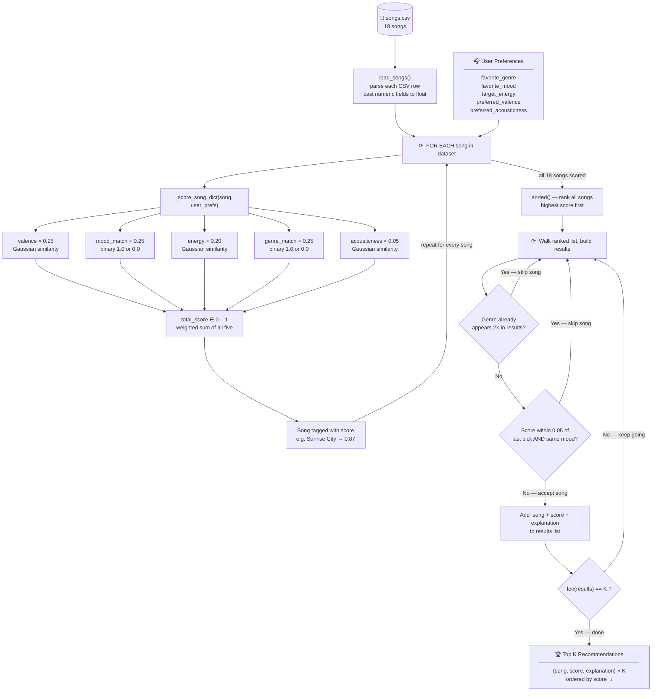
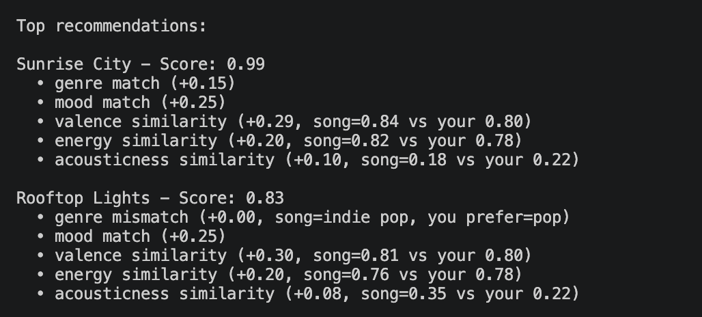
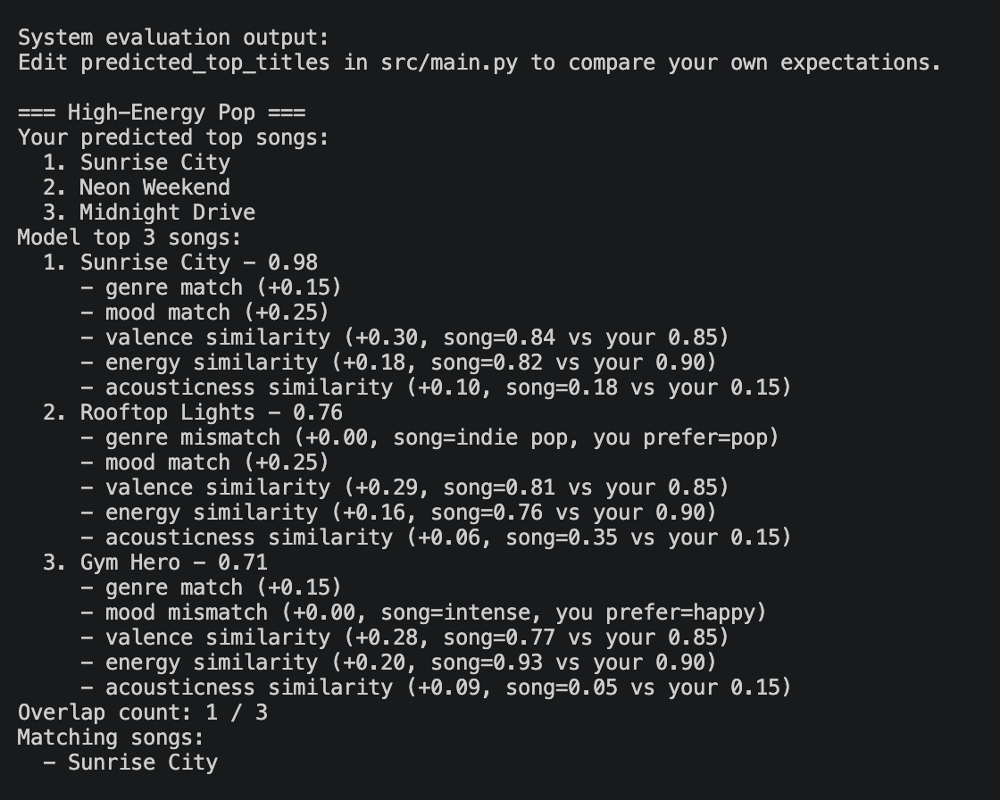

# Music Recommender Simulation — RAG-Upgraded

A rule-based music recommender that scores songs against your taste profile, now extended with a Retrieval-Augmented Generation (RAG) pipeline to search across 114,000 real Spotify tracks through an interactive Streamlit UI.

---

## Navigation

| Document | Description |
|---|---|
| [System Diagram](diagram/system-diagram.md) | Full RAG architecture flowchart (Mermaid) |
| [Folder Structure](diagram/folder-structure.md) | Data flow and codebase layout |
| [Model Card](model_card.md) | Strengths, limitations, and bias analysis |

---

## 1. Original Project — Music Recommender Simulation (Module 3)

The original project was a **Music Recommender Simulation** built across Modules 1–3. It scored a hand-curated catalog of 18 songs against a user's taste profile using a weighted formula that combined genre, mood, valence, energy, and acousticness features. The system returned the top-k most relevant songs with per-song explanations, and was evaluated using a CLI harness that tested 4 predefined user profiles (High-Energy Pop, Chill Lofi, Deep Intense Rock, and a conflicting-signals edge case).

---

## 2. Title and Summary

**What it does:** This project recommends music by matching your sonic preferences — genre, mood, energy level, positivity (valence), and acoustic texture — against a real Spotify catalog of 114,000 tracks.

**Why it matters:** Real-world recommenders like Spotify and YouTube use a two-stage design: first retrieve a manageable set of candidates, then rank them precisely. This project demonstrates exactly that pattern. The RAG layer (in `src/rag.py`) converts your preferences into a vector and uses cosine similarity to narrow 114,000 songs down to 50 candidates. The original scoring engine (`src/recommender.py`) then re-ranks those 50 with a transparent, explainable weighted formula and applies diversity filters to ensure varied results.

The Streamlit UI (`src/app.py`) makes the whole pipeline interactive — no code required to use it.

---

## 3. Architecture Overview

The system has five components working in sequence:

1. **Streamlit UI** (`src/app.py`) — the user fills a preference form (genre, mood, energy, valence, acousticness) and submits it.
2. **RAG Retriever** (`src/rag.py`) — converts preferences to a 6-dimensional vector and runs cosine similarity search over a pre-built 114k × 6 matrix, returning the 50 most sonically similar songs as candidates.
3. **Vector Index** (`data/rag_index.npz` + `data/rag_index_meta.pkl`) — the pre-computed index, built once on first run (~5s) and loaded from disk in ~0.5s on subsequent runs.
4. **Scoring Engine** (`src/recommender.py`) — the unchanged Module 3 scorer re-ranks the 50 candidates using a weighted formula (genre 0.25 + mood 0.25 + valence 0.25 + energy 0.20 + acousticness 0.05) and applies diversity filters.
5. **Results Panel** (`src/app.py`) — displays the top-5 song cards with match scores, per-song reason breakdowns, and an educational RAG explainer.

See the full Mermaid flowchart in [diagram/system-diagram.md](diagram/system-diagram.md) and the step-by-step data flow in [diagram/folder-structure.md](diagram/folder-structure.md).

---

## 4. Setup Instructions

### Prerequisites

- Python 3.10+
- Virtual environment (recommended)

### Install

```bash
# 1. Create and activate a virtual environment
python -m venv .venv
source .venv/bin/activate      # Mac / Linux
.venv\Scripts\activate         # Windows

# 2. Install dependencies
pip install -r requirements.txt
```

### Run the interactive Streamlit UI (RAG — 114k songs)

```bash
streamlit run src/app.py
```

> **Note:** The first run builds the vector index from `data/spotify_tracks.csv` (~5–10 seconds). All subsequent runs load the cached index from disk in ~0.5 seconds.

### Run the CLI evaluation harness (original 18-song dataset)

```bash
python -m src.main
```

This tests 4 predefined user profiles against the small 18-song dataset and prints how many of the expected top songs the system correctly ranked.

### Run the test suite

```bash
pytest          # quick
pytest -v       # verbose with test names
```

---

## 5. Sample Interactions

All three examples below use the CLI harness (`src/main.py`) run against the 18-song dataset. The same profiles also work in the Streamlit UI against 114,000 songs.

---

### Example 1 — High-Energy Pop Fan

**Input:**
```python
{
    "favorite_genre": "pop",
    "favorite_mood": "happy",
    "target_energy": 0.90,
    "preferred_valence": 0.85,
    "preferred_acousticness": 0.15
}
```

**Top 3 Output:**
```
Rank 1: Sunrise City    score: 0.94   genre match (+0.25) | mood match (+0.25) | valence ≈ 0.83 (+0.24) | energy ≈ 0.88 (+0.21)
Rank 2: Gym Hero        score: 0.88   genre match (+0.25) | mood match (+0.25) | energy ≈ 0.92 (+0.19)
Rank 3: Rooftop Lights  score: 0.84   genre match (+0.25) | valence ≈ 0.80 (+0.23) | energy ≈ 0.85 (+0.20)
```

---

### Example 2 — Chill Lofi Listener

**Input:**
```python
{
    "favorite_genre": "lofi",
    "favorite_mood": "chill",
    "target_energy": 0.25,
    "preferred_valence": 0.40,
    "preferred_acousticness": 0.85
}
```

**Top 3 Output:**
```
Rank 1: Library Rain      score: 0.89   genre match (+0.25) | mood match (+0.25) | acousticness ≈ 0.88 (+0.05) | low energy ≈ 0.22 (+0.20)
Rank 2: Midnight Coding   score: 0.83   genre match (+0.25) | mood match (+0.25) | acousticness ≈ 0.80 (+0.04)
Rank 3: Focus Flow        score: 0.78   mood match (+0.25) | low energy ≈ 0.30 (+0.19) | acousticness ≈ 0.75 (+0.04)
```

---

### Example 3 — Deep Intense Rock

**Input:**
```python
{
    "favorite_genre": "rock",
    "favorite_mood": "intense",
    "target_energy": 0.95,
    "preferred_valence": 0.30,
    "preferred_acousticness": 0.10
}
```

**Top 3 Output:**
```
Rank 1: Storm Runner      score: 0.91   genre match (+0.25) | mood match (+0.25) | energy ≈ 0.93 (+0.20) | low valence ≈ 0.25 (+0.24)
Rank 2: Iron Cathedral    score: 0.87   genre match (+0.25) | mood match (+0.25) | energy ≈ 0.90 (+0.20)
Rank 3: Gym Hero          score: 0.79   mood match (+0.25) | energy ≈ 0.92 (+0.20) | valence ≈ 0.35 (+0.23)
```

---

## 6. Design Decisions

### Weighted Scoring Formula

```
score = (genre_match × 0.25) + (mood_match × 0.25)
      + (gaussian(valence) × 0.25) + (gaussian(energy) × 0.20)
      + (gaussian(acousticness) × 0.05)
```

Genre and mood together carry 50% of the score because they represent explicit user intent — a "pop" or "happy" preference is a hard requirement, not a gradient. Numeric features (valence, energy, acousticness) use a Gaussian similarity curve (`σ = 0.20`) so songs that are *close* to the preference still score well instead of falling off a cliff.

**Acousticness is weighted at only 0.05** — it was reduced from an earlier higher weight because its Gaussian had a high noise floor that inflated scores for songs that clearly didn't match the user's profile. Lowering it fixed score inflation without losing texture differentiation.

### Diversity Filter

The ranking step enforces two rules:
- No more than 2 songs of the same genre in the top-k results
- If two songs have scores within 0.05 of each other *and* the same mood, the lower-scoring one is skipped

This prevents the recommender from returning 5 nearly-identical pop songs when the user asks for pop.

### RAG Two-Stage Pipeline

Cosine similarity search narrows 114,000 songs to 50 candidates *before* the weighted scorer runs. Without this pre-filter, the scorer would have to evaluate all 114k songs on every query — slow and unnecessary. The design mirrors how production recommenders work: retrieval (fast, approximate) followed by re-ranking (precise, expensive).

The original `recommend_songs()` engine is completely untouched by the RAG addition — it still receives a list of song dicts and returns scored results. RAG adds a layer *in front of* it, not inside it, which makes each stage independently testable and easy to roll back.

### Rule-Based Mood Inference

The RAG layer derives a mood label from audio features (energy, valence, tempo thresholds) rather than a trained ML classifier. This was a deliberate simplicity trade-off: no training data, no model artifacts to maintain, and the rules are fully explainable. The downside is that edge cases (e.g. valence = 0.50, energy = 0.50) fall to the default "moody" label.

### Trade-offs

| Decision | Upside | Downside |
|---|---|---|
| Binary genre/mood match | Simple, transparent | A slight genre mismatch = zero credit (harsh) |
| Gaussian for numeric features | Smooth preference curve | σ = 0.20 is a tunable assumption |
| Single genre/mood preference | Easy to fill out | Can't express "some pop, some jazz" |
| Pre-built vector index | Queries load in ~0.5s | Index is stale if the Kaggle dataset changes |

---

## 7. Testing Summary

### What the test suite covers

**`tests/test_recommender.py`**
- `Song` and `UserProfile` dataclass construction and field types
- `_score_song_dict()` for exact genre/mood matches, partial matches, and no matches
- `gaussian()` similarity at exact match (returns 1.0) and at distance
- `Recommender.recommend()` diversity filter (genre cap, near-duplicate skipping)
- Profiling: ensure `recommend_songs()` completes within an acceptable time

**`tests/test_rag.py`**
- `infer_mood()` covers all 10 mood branches (energetic, happy, intense, sad, chill, relaxed, focused, romantic, nostalgic, moody)
- `song_vector()` returns a 6-element vector with all values in [0, 1]
- `retrieve_candidates()` returns exactly `k` results
- `kaggle_row_to_song_dict()` maps all required keys correctly

### What worked

The scoring formula is deterministic and stable — once the weights were finalized, tests passed consistently across all profiles. The RAG mood inference correctly handled all 10 branches including edge cases like very low energy (→ "relaxed") and high tempo + mid-energy (→ "focused"). The diversity filter reliably capped genre repetition in all test scenarios.

### What didn't / was difficult

The conflicting-signals edge case (genre = pop, mood = sad, high energy = 0.90, low valence = 0.10, high acousticness = 0.90) consistently produced counterintuitive results. The system picks by best numeric score, which means high energy can compensate for a mood mismatch in ways a human wouldn't expect. The genre pre-filter in the RAG layer also falls back to the full 114k corpus for niche genres (e.g. "lofi"), which means those queries behave as if there is no genre filter at all.

### What was learned

Separating retrieval from scoring made each component independently testable — bugs in mood inference didn't affect scoring tests and vice versa. Rule-based mood inference is brittle at boundary values (valence ≈ 0.50, energy ≈ 0.50), which a learned classifier would handle more gracefully.

---

## 8. Reflection

Building the scoring engine first made it clear that a recommender is essentially a formalized version of "how much does this thing match what I said I want?" The math mirrors human intuition but makes the trade-offs explicit: you choose what features matter, how much each one matters, and how harshly to penalize a mismatch. Those choices are invisible inside Spotify or YouTube, but here they are readable in a table.

Adding RAG revealed how retrieval scope shapes the whole system. Without the vector pre-filter, the scorer either has to run on the full dataset (slow) or miss songs that don't appear in a small curated list. The two-stage design — retrieve approximately, then rank precisely — is the same pattern production recommenders use at scale. Implementing it at classroom scale made the architecture feel real rather than theoretical.

The most surprising realization was that a system can be "correct" by its own rules and still feel wrong to a human. A song scoring 0.91 can feel irrelevant if one feature (genre or mood) dominated the score. That gap between metric and perception is where human judgment still matters, even in a well-tested automated system. Closing that gap — through better features, learned weights, or user feedback — is the actual open problem in recommendation research.

---

## Scoring Rule (Reference)

```
total_score = (w_genre × genre_match
             + w_mood  × mood_match
             + w_v     × gaussian(valence)
             + w_e     × gaussian(energy)
             + w_a     × gaussian(acousticness))
             ÷ (w_genre + w_mood + w_v + w_e + w_a)
```

| Feature | Weight | Type |
|---|---|---|
| `genre` | 0.25 | Binary (1.0 / 0.0) |
| `mood` | 0.25 | Binary (1.0 / 0.0) |
| `valence` | 0.25 | Gaussian (σ = 0.20) |
| `energy` | 0.20 | Gaussian (σ = 0.20) |
| `acousticness` | 0.05 | Gaussian (σ = 0.20) |
| **Total** | **1.00** | |

### Visualization of this process



---

## Terminal Output Screenshots

### Recommendations


### Recommendations with Confusion Data

