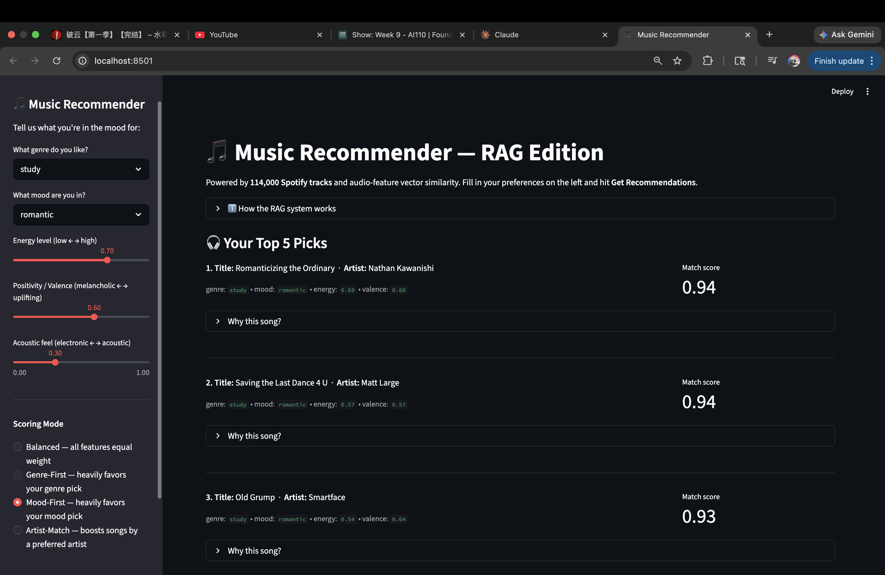
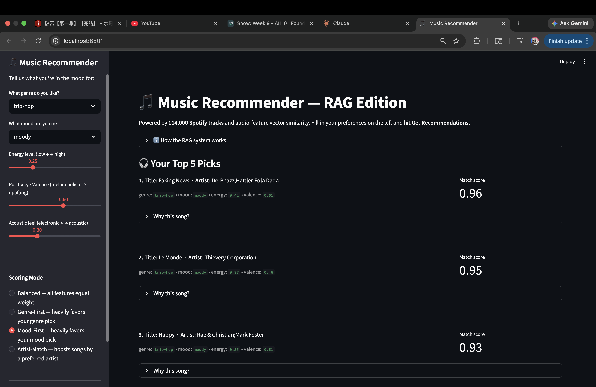

# Music Recommender Simulation — RAG-Upgraded

A rule-based music recommender that scores songs against your taste profile, now extended with a Retrieval-Augmented Generation (RAG) pipeline to search across 114,000 real Spotify tracks through an interactive Streamlit UI.

---

## Navigation

| Document | Description |
|---|---|
| [System Diagram](diagram/system-diagram.md) | Full RAG architecture flowchart (Mermaid) |
| [Folder Structure](diagram/folder-structure.md) | Data flow and codebase layout |
| [Model Card](model_card.md) | Strengths, limitations, and bias analysis |

---

## 1. Original Project — Music Recommender Simulation (Module 3)

The original project was a **Music Recommender Simulation** built across Modules 3. It scored a hand-curated catalog of 18 songs against a user's taste profile using a weighted formula that combined genre, mood, valence, energy, and acousticness features. The system returned the top 5 most relevant songs with per-song explanations, and was evaluated using a CLI harness that tested 4 predefined user profiles (High-Energy Pop, Chill Lofi, Deep Intense Rock, and a conflicting-signals edge case).

---

## 2. Title and Summary

**What it does:** This project recommends music by matching your sonic preferences — genre, mood, energy level, positivity (valence), and acoustic texture — against a real Spotify catalog of 114,000 tracks.

**Why it matters:** Real-world recommenders like Spotify and YouTube use a two-stage design: first retrieve a manageable set of candidates, then rank them precisely. This project apply this logic by asking user their preferred genre , mood or artist. The RAG layer (in `src/rag.py`) converts your preferences into a vector and uses cosine similarity to narrow 114,000 songs down to top 5 songs. The original scoring engine (`src/recommender.py`) then re-ranks the songs based on the top matching score with a transparent, explainable weighted formula to iindicate the accuracy of the result.

The Streamlit UI (`src/app.py`) makes the whole pipeline interactive — no code required to use it.

---

## 3. Architecture Overview

The system has five components working in sequence:

1. **Streamlit UI** (`src/app.py`) — the user fills a preference form (genre, mood, energy, valence, acousticness) and submits it.
2. **RAG Retriever** (`src/rag.py`) — converts preferences to a 6-dimensional vector and runs cosine similarity search over a pre-built 114k × 6 matrix, returning the 50 most sonically similar songs as candidates.
3. **Vector Index** (`data/rag_index.npz` + `data/rag_index_meta.pkl`) — the pre-computed index, built once on first run (~5s) and loaded from disk in ~0.5s on subsequent runs.
4. **Scoring Engine** (`src/recommender.py`) — the unchanged Module 3 scorer re-ranks the 50 candidates using a weighted formula (genre 0.25 + mood 0.25 + valence 0.25 + energy 0.20 + acousticness 0.05) and applies diversity filters.
5. **Results Panel** (`src/app.py`) — displays the top-5 song cards with match scores, per-song reason breakdowns, and an educational RAG explainer.

See the full Mermaid flowchart in [diagram/system-diagram.md](diagram/system-diagram.md) and the step-by-step data flow in [diagram/folder-structure.md](diagram/folder-structure.md).

---

## 4. Setup Instructions

### Prerequisites

- Python 3.10+
- Virtual environment (recommended)

### Install

```bash
# 1. Create and activate a virtual environment
python -m venv .venv
source .venv/bin/activate      # Mac / Linux
.venv\Scripts\activate         # Windows

# 2. Install dependencies
pip install -r requirements.txt
```

### Run the interactive Streamlit UI (RAG — 114k songs)

```bash
streamlit run src/app.py
```

> **Note:** The first run builds the vector index from `data/spotify_tracks.csv` (~5–10 seconds). All subsequent runs load the cached index from disk in ~0.5 seconds.

### Run the CLI evaluation harness (original 18-song dataset)

```bash
python -m src.main
```

This tests 4 predefined user profiles against the small 18-song dataset and prints how many of the expected top songs the system correctly ranked.

### Run the test suite

```bash
pytest          # quick
pytest -v       # verbose with test names
```

---

## 5. Sample Interactions

All three examples below use `recommend_songs()` from `src/recommender.py` run against the controlled 18-song test fixture used in `tests/test_recommender.py`. The same scoring logic runs in the Streamlit UI against 114,000 songs.

---

### Example 1 — Genre-First: Pop / Happy

Scoring mode: **Genre-First** (genre weight = 0.50). Genre match dominates; all top results are `pop` regardless of other features.

**Input:**
```python
{
    "favorite_genre": "pop",
    "favorite_mood": "happy",
    "target_energy": 0.80,
    "preferred_valence": 0.75,
    "preferred_acousticness": 0.15,
    "scoring_mode": "Genre-First"
}
```

**Top 3 Output:**
```
Rank 1: Pop Happy Anthem   artist: PopStar      genre: pop   mood: happy   score: 1.00
        genre match (+0.50) | mood match (+0.20) | valence 0.75 (+0.15) | energy 0.80 (+0.10)

Rank 2: Rare Pop Jam       artist: RareArtist   genre: pop   mood: happy   score: 1.00
        genre match (+0.50) | mood match (+0.20) | valence 0.75 (+0.15) | energy 0.80 (+0.10)

Rank 3: Pop Vibes          artist: PopStar      genre: pop   mood: happy   score: 1.00
        genre match (+0.50) | mood match (+0.20) | valence 0.74 (+0.15) | energy 0.79 (+0.10)
```

> **What this shows:** Genre match contributes +0.50 to every result. Non-pop songs (Rock Power, Electronic Surge) score below 0.25 in this mode and never surface in the top 5.

---

### Example 2 — Mood-Genre Conflict: Same Input, Two Modes

User picks `genre = pop` but `mood = sad`. The scoring mode determines which preference wins.

**Input:**
```python
{
    "favorite_genre": "pop",
    "favorite_mood": "sad",
    "target_energy": 0.80,
    "preferred_valence": 0.75,
    "preferred_acousticness": 0.15
}
```

**Genre-First output** (genre weight = 0.50, mood weight = 0.20):
```
Rank 1: Pop Happy Anthem   genre: pop   mood: happy   score: 0.80
        genre match (+0.50) | mood mismatch (+0.00) | valence 0.75 (+0.15) | energy 0.80 (+0.10)

Rank 2: Rare Pop Jam       genre: pop   mood: happy   score: 0.80
        genre match (+0.50) | mood mismatch (+0.00) | valence 0.75 (+0.15) | energy 0.80 (+0.10)

Rank 3: Pop Vibes          genre: pop   mood: happy   score: 0.80
        genre match (+0.50) | mood mismatch (+0.00) | valence 0.74 (+0.15) | energy 0.79 (+0.10)
```

**Mood-First output** (mood weight = 0.50, genre weight = 0.20):
```
Rank 1: Pop Melancholy     genre: pop   mood: sad    score: 0.73
        genre match (+0.20) | mood match (+0.50) | valence 0.25 (+0.01) | energy 0.35 (+0.01)

Rank 2: Pop Heartbreak     genre: pop   mood: sad    score: 0.71
        genre match (+0.20) | mood match (+0.50) | valence 0.20 (+0.00) | energy 0.30 (+0.00)

Rank 3: Rock Lament        genre: rock  mood: sad    score: 0.52
        genre mismatch (+0.00) | mood match (+0.50) | valence 0.25 (+0.01) | energy 0.30 (+0.00)
```

> **What this shows:** Switching from Genre-First to Mood-First completely changes the #1 result. In Genre-First, pop/happy songs (score 0.80) outrank pop/sad songs (score ~0.73) because the 0.50 genre weight is unchanged and the numerical features (energy, valence) favour the happier songs. In Mood-First, the 0.50 mood weight flips the ranking.

---

### Example 3 — Artist-Match Edge Case: Fewer Than 5 Songs

Preferred artist `RareArtist` has only 3 songs in the dataset. The system returns all 3 first, then falls back to pop/happy songs that best match the remaining features.

**Input:**
```python
{
    "favorite_genre": "pop",
    "favorite_mood": "happy",
    "target_energy": 0.80,
    "preferred_valence": 0.75,
    "preferred_acousticness": 0.15,
    "preferred_artist": "RareArtist",
    "scoring_mode": "Artist-Match"
}
```

**Top 5 Output:**
```
Rank 1: Rare Pop Jam    artist: RareArtist   genre: pop   mood: happy   score: 0.93
        artist match (+0.43, RareArtist, popularity=85/100)

Rank 2: Rare Pop Groove artist: RareArtist   genre: pop   mood: happy   score: 0.86
        artist match (+0.36, RareArtist, popularity=72/100)

Rank 3: Rare Pop Echo   artist: RareArtist   genre: pop   mood: happy   score: 0.80
        artist match (+0.30, RareArtist, popularity=60/100)

Rank 4: Pop Happy Anthem artist: PopStar     genre: pop   mood: happy   score: 0.50
        artist mismatch (+0.00) | genre match (+0.12) | mood match (+0.12)

Rank 5: Pop Vibes        artist: PopStar     genre: pop   mood: happy   score: 0.50
        artist mismatch (+0.00) | genre match (+0.12) | mood match (+0.12)
```

> **What this shows:** If there is a mood–genre conflict, the result is ranked based on the user's selected scoring mode preference.

---

## 6. Design Decisions

### Weighted Scoring Formula

Each song is scored using a weighted sum. The weights depend on the selected scoring mode:

```
score = (genre_match × w_genre) + (mood_match × w_mood)
      + (gaussian(valence) × w_valence) + (gaussian(energy) × w_energy)
      + (gaussian(acousticness) × w_acousticness)
      + (artist_boost × w_artist)          # Artist-Match mode only
```

| Weight | Balanced | Genre-First | Mood-First | Artist-Match |
|---|---|---|---|---|
| `w_genre` | 0.25 | **0.50** | 0.20 | 0.125 |
| `w_mood` | 0.25 | 0.20 | **0.50** | 0.125 |
| `w_valence` | 0.25 | 0.15 | 0.15 | 0.125 |
| `w_energy` | 0.20 | 0.10 | 0.10 | 0.10 |
| `w_acousticness` | 0.05 | 0.05 | 0.05 | 0.025 |
| `w_artist` | 0.00 | 0.00 | 0.00 | **0.50** |

Genre and mood use binary matching (1.0 if match, 0.0 otherwise). Numeric features (valence, energy, acousticness) use a Gaussian similarity curve (`σ = 0.20`) so songs close to the preference still score well. The artist term is only active in Artist-Match mode and is scaled by the song's popularity (0–100).

### Diversity Filter

The ranking step enforces two rules:
- No more than 2 songs of the same genre in the top-k results
- If two songs have scores within 0.05 of each other *and* the same mood, the lower-scoring one is skipped

This prevents the recommender from returning 5 nearly-identical pop songs when the user asks for pop.

### RAG Two-Stage Pipeline

Cosine similarity search narrows 114,000 songs to 50 candidates *before* the weighted scorer runs. Without this pre-filter, the scorer would have to evaluate all 114k songs on every query — slow and unnecessary. The design mirrors how production recommenders work: retrieval (fast, approximate) followed by re-ranking (precise, expensive).

The original `recommend_songs()` engine is completely untouched by the RAG addition — it still receives a list of song dicts and returns scored results. RAG adds a layer *in front of* it, not inside it, which makes each stage independently testable and easy to roll back.

### Rule-Based Mood Inference

The RAG layer derives a mood label from audio features (energy, valence, tempo thresholds) rather than a trained ML classifier. This was a deliberate simplicity trade-off: no training data, no model artifacts to maintain, and the rules are fully explainable. The downside is that edge cases (e.g. valence = 0.50, energy = 0.50) fall to the default "moody" label.

### Trade-offs

| Decision | Upside | Downside |
|---|---|---|
| Single genre/mood preference | Easy to fill out | Can't express "some pop, some jazz" |
| Pre-built vector index | Queries load in ~0.5s | Index is stale if the Kaggle dataset changes |

---

## 7. Testing Summary

### What the test suite covers

**`tests/test_recommender.py`** — 14 tests across two layers

**Layer 1 — `_score_song_dict()` weight verification (7 tests)**

These tests call the scoring function directly with a perfect-match song (all numerical values equal user preferences, Gaussian = 1.0) and each mode's `ScoringWeights`, asserting the exact computed score:

| Test | Mode | Expected score | Formula |
|---|---|---|---|
| `test_score_balanced_perfect_match` | Balanced | 1.0 | 0.25+0.25+0.25+0.20+0.05 |
| `test_score_genre_first_perfect_match` | Genre-First | 1.0 | 0.50+0.20+0.15+0.10+0.05 |
| `test_score_mood_first_perfect_match` | Mood-First | 1.0 | 0.20+0.50+0.15+0.10+0.05 |
| `test_score_artist_match_perfect_match` | Artist-Match | 0.95 | 0.50×(90/100)+0.125+0.125+0.125+0.10+0.025 |
| `test_score_genre_first_genre_mismatch` | Genre-First | 0.50 | genre drops to 0; mood+numerics remain |
| `test_score_mood_first_mood_mismatch` | Mood-First | 0.50 | mood drops to 0; genre+numerics remain |

**Layer 2 — `recommend_songs()` runtime behavior tests (7 tests)**

These mirror actual Streamlit user interactions against a controlled 18-song fixture. All tests verify that top-5 match scores exceed the **0.7 quality threshold** shown in the UI (`st.metric("Match score", ...)`).

| Test | Mode | Assertion |
|---|---|---|
| `test_balanced_all_scores_above_threshold` | Balanced | All 5 scores > 0.7 |
| `test_genre_first_top5_same_genre` | Genre-First | All 5 results have `genre == "pop"`, scores > 0.7 |
| `test_mood_first_top5_same_mood` | Mood-First | All 5 results have `mood == "happy"`, scores > 0.7 |
| `test_conflict_genre_vs_mood` | Genre-First vs Mood-First | Same user (genre=pop, mood=sad): Genre-First ranks pop/happy #1; Mood-First ranks pop/sad #1 |
| `test_artist_match_top5_by_preferred_artist_sorted_by_popularity` | Artist-Match | All 5 by preferred artist, sorted by decreasing popularity, scores > 0.7 |
| `test_artist_match_edge_case_fewer_than_5_songs` | Artist-Match | First 3 from artist (scores > 0.7); positions 4–5 fall back to pop/happy songs |

**`tests/test_rag.py`** — 22 tests 
- `infer_mood()` covers all mood branches (energetic, happy, intense, sad, chill, relaxed, focused, romantic, nostalgic, moody fallback)
- `song_vector()` shape, dtype, value range, and tempo normalization
- `retrieve_candidates()` returns exactly `k` results and handles `k > n`
- `kaggle_row_to_song_dict()` required keys, types, and inferred mood
- `user_profile_to_vector()` shape, range, and energy mapping
- `rag_recommend()` result count and `(song, score, reasons)` tuple structure

### What worked

- Layer 1 tests confirmed all 50 mode weight tables are applied correctly at the function level, and 
- Layer 2 tests confirmed that the mode choice produces the expected behavioral outcomes (e.g. the same genre=pop/mood=sad user gets a different #1 result in Genre-First vs Mood-First). The Artist-Match popularity ordering was reliably maintained across all fixture runs.

### What didn't / was difficult

The conflicting-signals edge case (genre=pop, mood=sad, high energy) exposes that the system picks by best numeric score — a pop/happy song can outscore a pop/sad song in Genre-First because its energy and valence are numerically closer to the user's sliders, even when the user explicitly asked for "sad."， this issue still remains a big issue when it comes to a real world music recommedner system.

### What was learned

I learned how to implement RAG system into a music recommendation systema plus evaluting my result based on test cases and user manual input to ensure the result closely matches wth user expected output. 
---

## 8. Reflection

Adding RAG revealed how retrieval scope shapes the whole system. Without the vector pre-filter, the scorer either has to run on the full dataset (slow) or miss songs that don't appear in a small curated list using two-stage design retrieve approximately, then rank precisely. 

The most surprising realization was that a system can be "correct" by its own rules and the outpur can still feel wrong. For example , A high song scoring 0.91 can feel irrelevant if one feature (genre or mood) dominated the score or confusion matrix was applied. Hence, imeplementing more diverse attributes like classifying useres with simialr genre and mood will definenly create a more precise result tat fits user taste. 
---

## Scoring Rule (Reference)

```
total_score = w_genre × genre_match
            + w_mood  × mood_match
            + w_v     × gaussian(valence,      σ=0.20)
            + w_e     × gaussian(energy,        σ=0.20)
            + w_a     × gaussian(acousticness,  σ=0.20)
            + w_artist × (popularity / 100)   [only when artist matches]
```

Genre and mood use binary matching (1.0 if match, 0.0 otherwise). Numerical features use a Gaussian similarity curve so nearby values still score well. The `artist` term is only active in Artist-Match mode and is weighted by the song's popularity (0–100).

### Scoring Modes

| Feature | Balanced | Genre-First | Mood-First | Artist-Match |
|---|---|---|---|---|
| `genre` | 0.25 | **0.50** | 0.20 | 0.125 |
| `mood` | 0.25 | 0.20 | **0.50** | 0.125 |
| `valence` | 0.25 | 0.15 | 0.15 | 0.125 |
| `energy` | 0.20 | 0.10 | 0.10 | 0.10 |
| `acousticness` | 0.05 | 0.05 | 0.05 | 0.025 |
| `artist` | 0.00 | 0.00 | 0.00 | **0.50** |
| **Total** | **1.00** | **1.00** | **1.00** | **1.00** |

## Output Screenshots

### Genre Based Recommender Output


### Mood Based Recommender Output


### Confusion matrix Recommender Output

