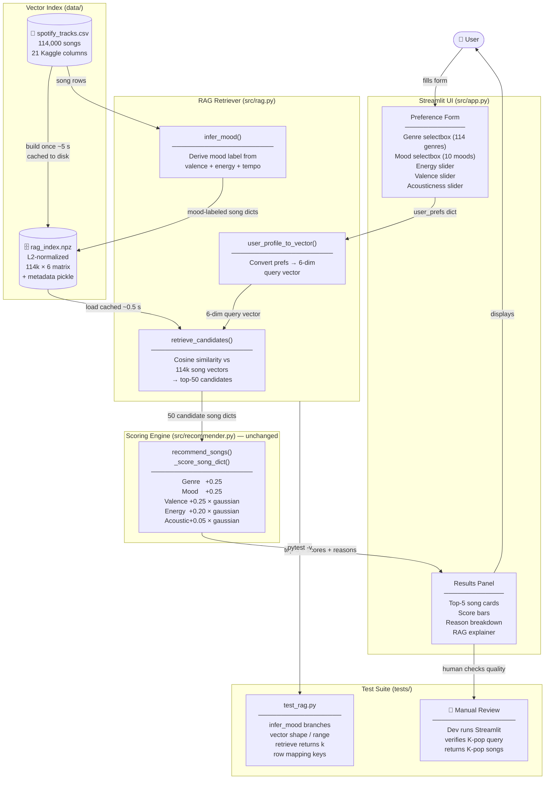

## Complete System Diagram

The diagram below shows the **extended RAG architecture** that upgrades the original 18-song system to search across 114,000 real Spotify tracks. The existing scoring engine (`_score_song_dict`, `recommend_songs`) is unchanged — RAG adds a retrieval step *in front of* it.

